# BookVault-Laravel アーキテクチャ完全ガイド 📚

> **生きたドキュメント（Living Documentation）**
> 
> このドキュメントは、コードの行間から読み取った設計意図、データフロー、そして機能追加時のガイドラインを提供します。
> 単なるファイル一覧ではなく、「なぜこの設計を選んだのか」「次に機能追加するならどこを触るべきか」を記述しています。

---

## 📋 目次

1. [システム全体像](#システム全体像)
2. [アーキテクチャ決定記録（ADR）](#アーキテクチャ決定記録adr)
3. [データフロー詳細](#データフロー詳細)
4. [Reactコンポーネント依存関係図](#reactコンポーネント依存関係図)
5. [バックエンドアーキテクチャ](#バックエンドアーキテクチャ)
6. [機能追加ガイド](#機能追加ガイド)
7. [セキュリティアーキテクチャ](#セキュリティアーキテクチャ)
8. [パフォーマンス設計](#パフォーマンス設計)

---

## システム全体像

### ハイレベルアーキテクチャ

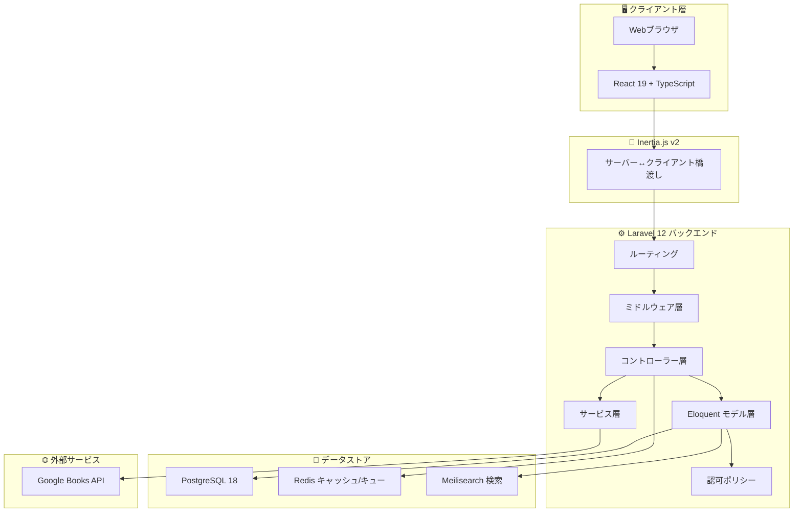

### 技術スタック選定理由

| 技術 | 選定理由 |
|------|----------|
| **Laravel 12** | PHPエコシステムの成熟度、豊富なファーストパーティツール（Fortify, Wayfinder等）|
| **React 19 + TypeScript** | 型安全性、React Compilerによる自動最適化、大規模アプリへの対応力 |
| **Inertia.js v2** | SPAのUXとMPAの開発速度を両立、API不要のフルスタック開発 |
| **PostgreSQL** | JSONサポート、全文検索、トランザクション信頼性 |
| **Redis** | 高速セッション管理、キューイング、キャッシュの統一 |
| **Meilisearch** | 日本語対応の高速全文検索、Elasticsearchより軽量 |

---

## アーキテクチャ決定記録（ADR）

### ADR-001: Inertia.js採用の理由

**背景**: フロントエンドをReactで構築したいが、REST APIを別途設計・管理するコストを削減したい。

**決定**: Inertia.jsを採用し、LaravelコントローラーからReactコンポーネントへ直接propsを渡す。

**理由**:
- API設計・ドキュメント化のコスト削減
- 既存のLaravelミドルウェア、認証、バリデーションをそのまま活用
- SSR対応によるSEO最適化が可能
- ページ遷移時のフルページリロード不要（SPA体験）

**トレードオフ**:
- モバイルアプリ開発時は別途APIが必要
- Inertia.js固有の学習コスト

**代替案**: REST API + SPA（却下：開発コスト増大）

---

### ADR-002: Laravel Fortifyによるヘッドレス認証

**背景**: 認証UIをReactで完全制御したいが、認証ロジックは堅牢なものを使いたい。

**決定**: Laravel Fortifyをヘッドレス認証バックエンドとして使用。

**理由**:
- UIを自由にカスタマイズ可能
- 2FA（TOTP）、パスワードリセット、メール確認が標準装備
- Laravel Jetstream/Breezeのような「意見の押し付け」がない
- セキュリティのベストプラクティスが組み込み済み

**影響を受けるファイル**:
- `config/fortify.php` - Fortify設定
- `app/Actions/Fortify/*` - カスタム認証アクション
- `resources/js/pages/auth/*` - 認証UIコンポーネント

---

### ADR-003: Wayfinder採用による型安全ルーティング

**背景**: フロントエンドでルート名を文字列で指定するとタイポが発生しやすい。

**決定**: Laravel Wayfinderを採用し、TypeScript型定義を自動生成。

**理由**:
- `route('books.show', { book: 1 })` がTypeScriptで型チェックされる
- ルート名変更時にコンパイルエラーで検出可能
- IDEの補完が効く

**使用方法**:
```typescript
import { route } from '@/routes';
// 型安全なルート生成
const url = route('books.show', { book: bookId });
```

---

### ADR-004: 蔵書管理の分離設計（Book vs BookCopy）

**背景**: 同じ書籍を複数所蔵する図書館システムでは、「書籍情報」と「個別の蔵書」を区別する必要がある。

**決定**: `Book`（書籍メタデータ）と `BookCopy`（個別蔵書）を分離。

**理由**:
- 1冊の書籍に対して複数のコピーを管理可能
- 各コピーの状態（貸出中、修理中等）を個別追跡
- 廃棄日（discarded_date）により物理的な蔵書ライフサイクル管理

**データモデル**:
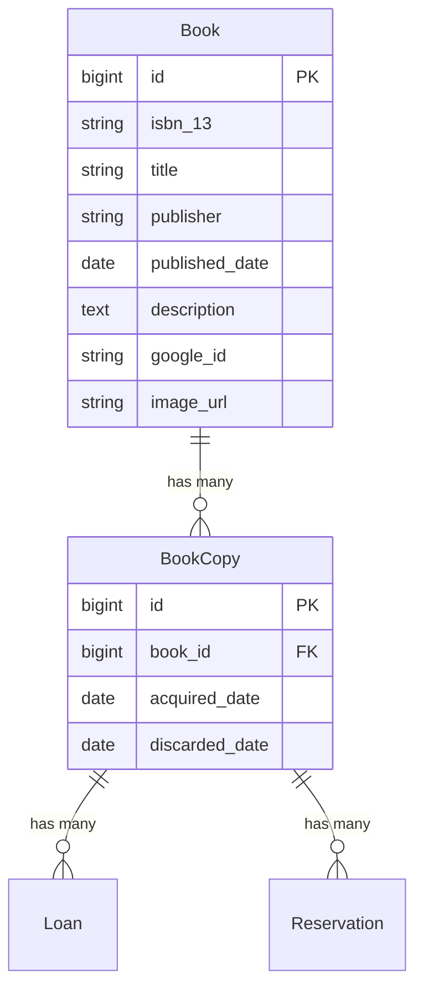

---

### ADR-005: ポリシーベース認可 vs ミドルウェア認可

**背景**: 管理者権限チェックをどこで行うべきか。

**決定**: ハイブリッドアプローチを採用。

| 認可タイプ | 実装場所 | 用途 |
|-----------|---------|------|
| **ロールベース** | ミドルウェア | `/admin/*` ルート全体の保護 |
| **所有権ベース** | ポリシー | レビュー編集時の所有者チェック |

**理由**:
- ミドルウェアはルートグループ単位での保護に最適
- ポリシーはモデル単位での細かい認可に最適
- 責務の分離により、保守性向上

**実装例**:
```php
// routes/web.php - ミドルウェアで管理者ルート保護
Route::middleware(['auth', 'verified', 'admin'])->prefix('admin')->group(function () {
    // 管理者専用ルート
});

// ReviewController.php - ポリシーで所有権チェック
$this->authorize('update', $review);
```

---

## データフロー詳細

### 📖 書籍貸出フロー

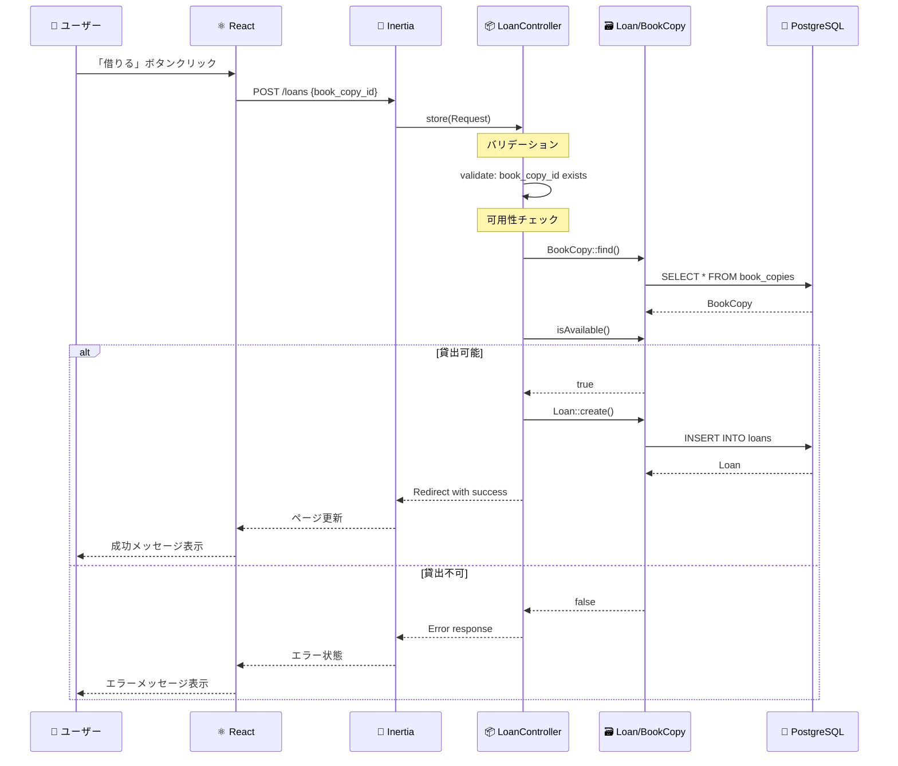

**設計のポイント**:
1. `BookCopy.isAvailable()` がビジネスロジックをカプセル化
2. 同時貸出を防ぐため、`isAvailable()` は `discarded_date IS NULL AND no active loans` を確認
3. 返却処理は `Loan.returnBook()` メソッドで `returned_date` を更新

---

### 🔐 認証・2FAフロー

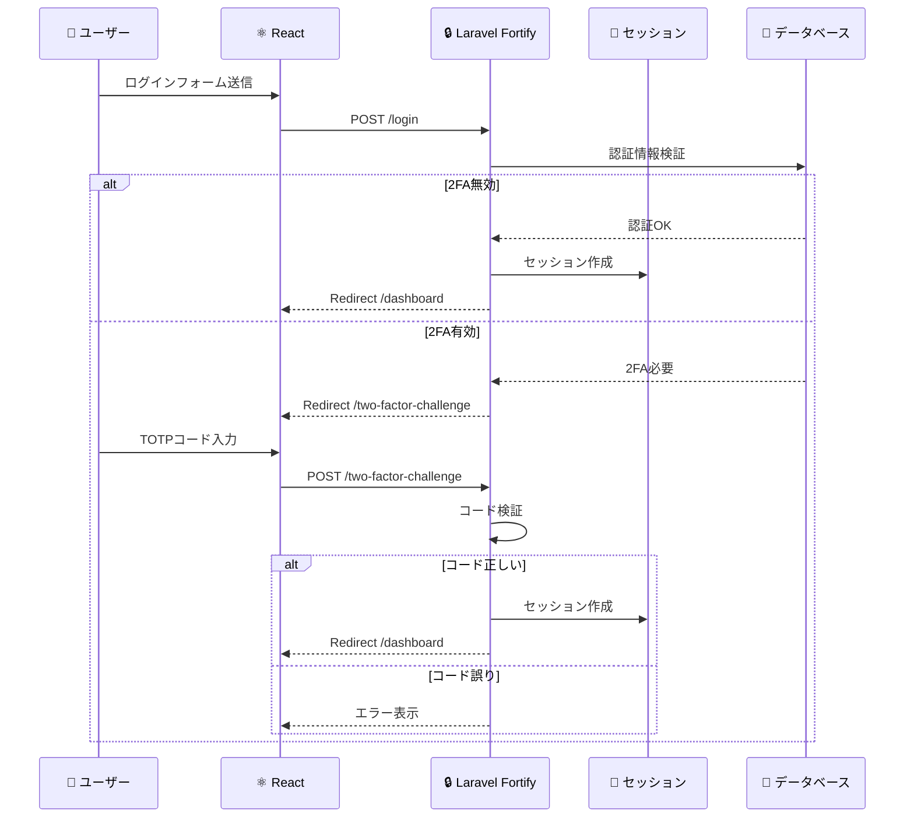

**2FAの内部動作**:
1. `User` モデルに `TwoFactorAuthenticatable` トレイトを使用
2. 秘密鍵は `two_factor_secret` カラムに暗号化保存
3. リカバリーコードは `two_factor_recovery_codes` に JSON配列で保存
4. 確認済みフラグは `two_factor_confirmed_at` タイムスタンプ

---

### 📚 Google Books API 連携フロー

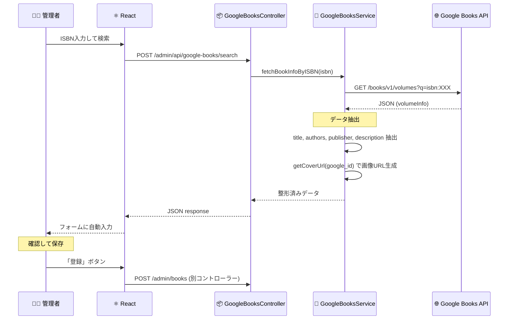

**なぜServiceクラスを分離したか**:
1. 外部API呼び出しをコントローラーから分離し、テスタビリティ向上
2. APIレスポンスの変換ロジックを一箇所に集約
3. 将来的に別の書籍APIへの切り替えが容易

---

### 🔍 書籍検索フロー

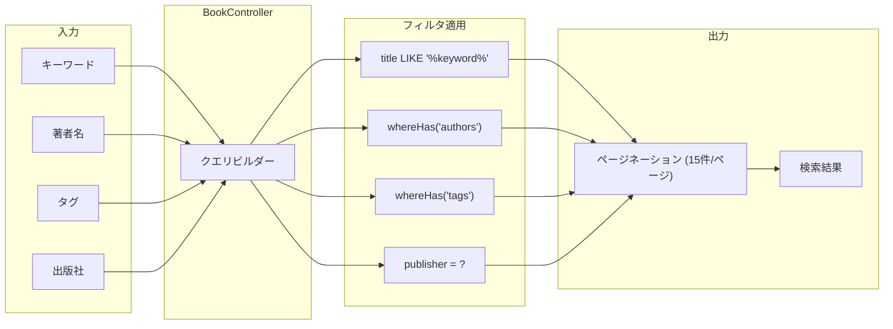

**検索の最適化ポイント**:
1. `whereHas` で関連テーブルを効率的にフィルタ
2. Eager Loading (`with(['authors', 'tags'])`) でN+1回避
3. 将来的にMeilisearchへの移行が容易な設計

---

## Reactコンポーネント依存関係図

### 全体構造

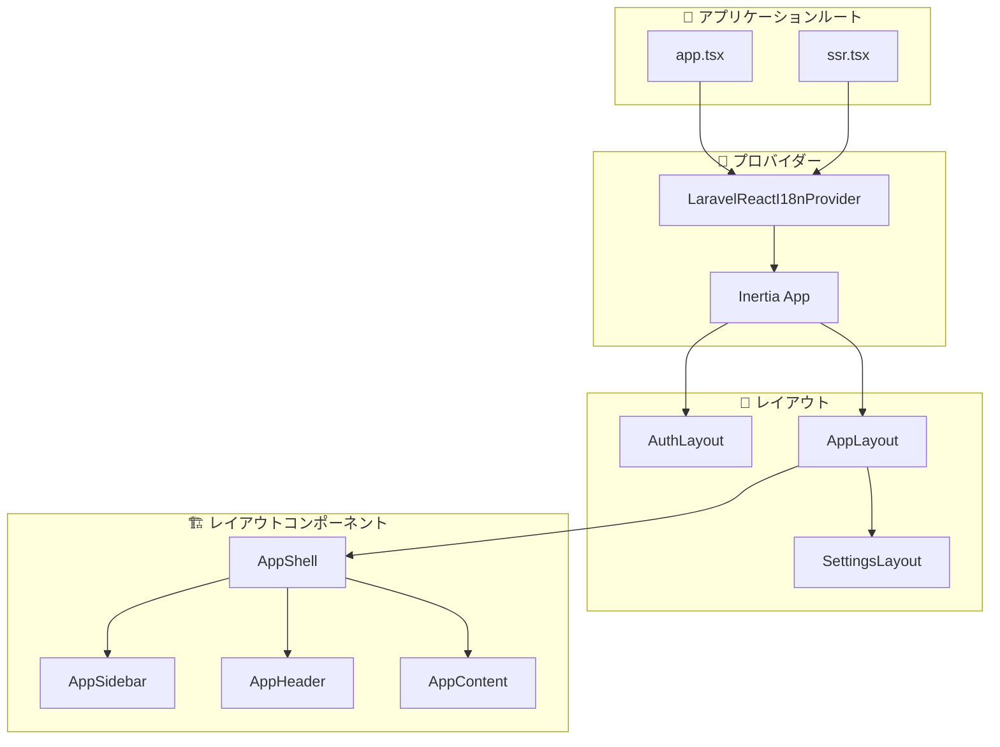

### ページ別コンポーネント依存関係

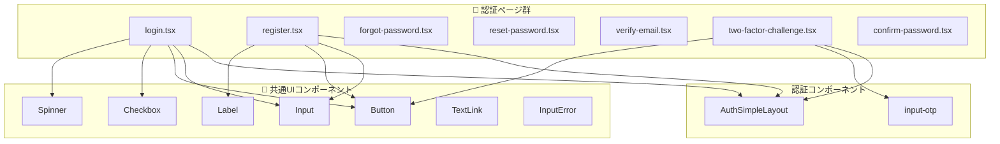

### 管理画面コンポーネント構造

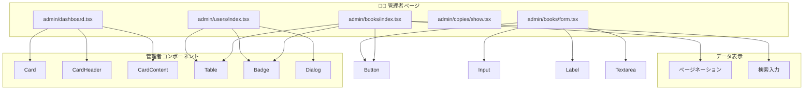

### 設定ページコンポーネント構造

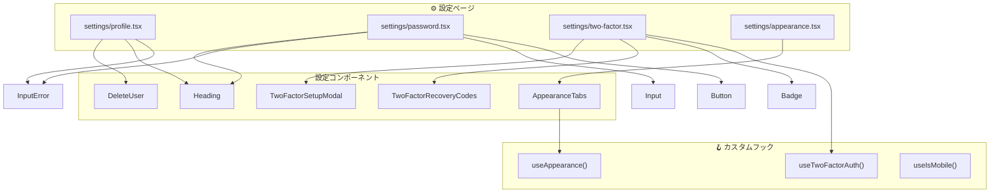

### サイドバー・ナビゲーション構造

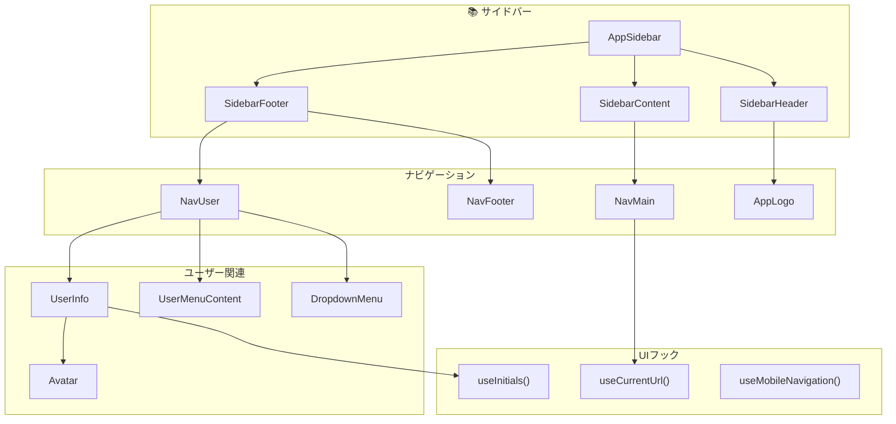

### 共通UIコンポーネント依存関係

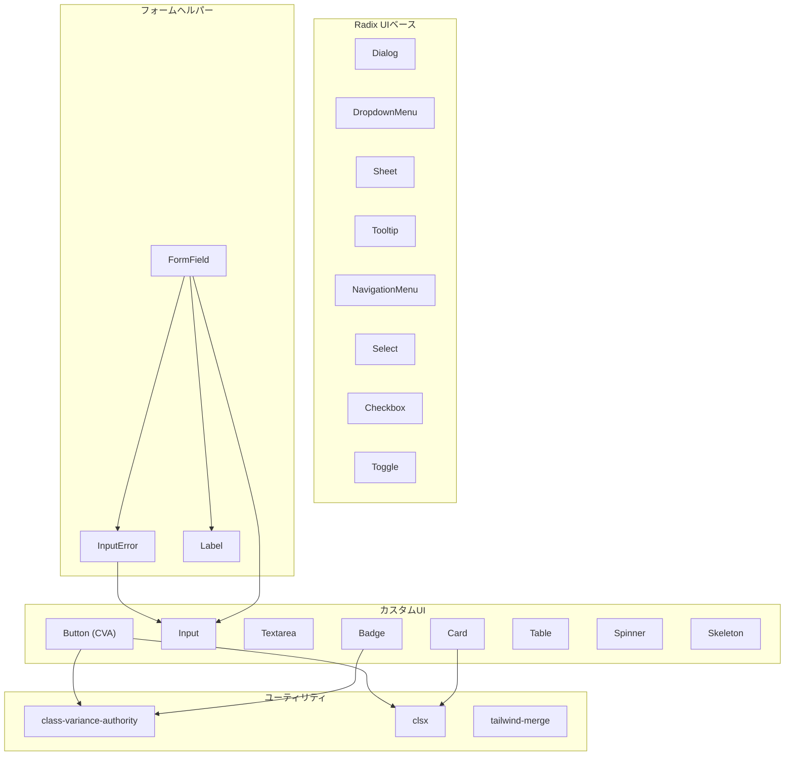

---

## バックエンドアーキテクチャ

### コントローラー責務マップ

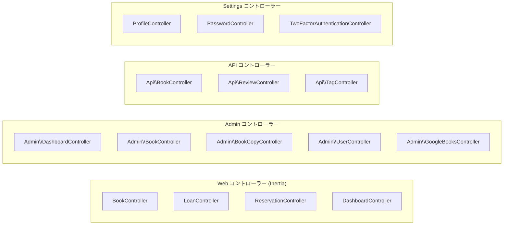

### モデルリレーションシップ完全図

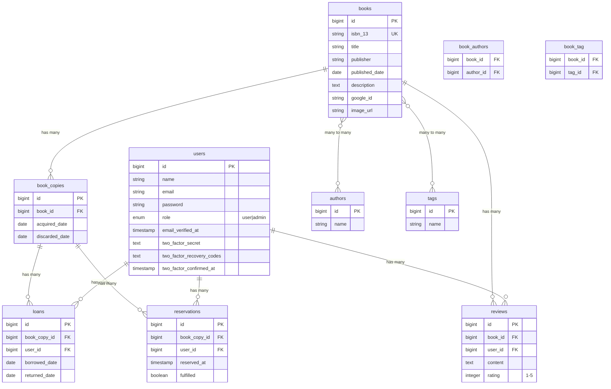

### ミドルウェアスタック

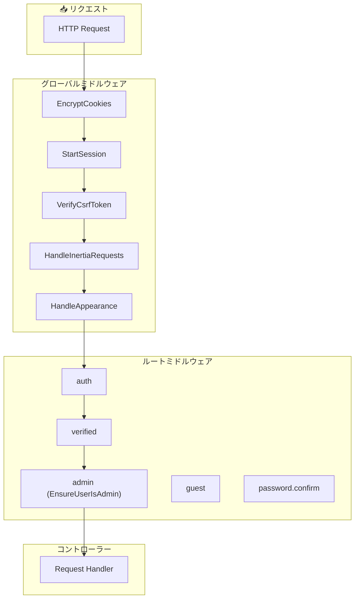

---

## 機能追加ガイド

### 🆕 新機能追加チェックリスト

新しい機能を追加する際は、以下の手順に従ってください：

#### 1. データベース層
```bash
# マイグレーション作成
php artisan make:migration create_feature_table

# モデル作成（ファクトリー、シーダー付き）
php artisan make:model Feature -mfs
```

**触るファイル**:
- `database/migrations/` - テーブル定義
- `app/Models/` - Eloquentモデル
- `database/factories/` - テストデータ生成

#### 2. バックエンド層
```bash
# コントローラー作成
php artisan make:controller FeatureController --resource

# リクエストバリデーション作成
php artisan make:request StoreFeatureRequest

# ポリシー作成（認可が必要な場合）
php artisan make:policy FeaturePolicy --model=Feature
```

**触るファイル**:
- `app/Http/Controllers/` - コントローラー
- `app/Http/Requests/` - バリデーション
- `app/Policies/` - 認可ルール
- `routes/web.php` または `routes/api.php` - ルート定義

#### 3. フロントエンド層
```bash
# Wayfinderルート更新
php artisan wayfinder:generate
```

**触るファイル**:
- `resources/js/pages/` - ページコンポーネント
- `resources/js/components/` - 再利用可能コンポーネント
- `resources/js/types/` - TypeScript型定義

#### 4. テスト層
```bash
# フィーチャーテスト作成
php artisan make:test FeatureControllerTest
```

**触るファイル**:
- `tests/Feature/` - 統合テスト
- `tests/Unit/` - 単体テスト

---

### 📖 具体例: 「お気に入り機能」を追加する場合

#### Step 1: マイグレーション
```php
// database/migrations/xxxx_create_favorites_table.php
Schema::create('favorites', function (Blueprint $table) {
    $table->id();
    $table->foreignId('user_id')->constrained()->onDelete('cascade');
    $table->foreignId('book_id')->constrained()->onDelete('cascade');
    $table->timestamps();
    
    $table->unique(['user_id', 'book_id']); // 重複防止
});
```

#### Step 2: モデル
```php
// app/Models/Favorite.php
class Favorite extends Model
{
    protected $fillable = ['user_id', 'book_id'];
    
    public function user(): BelongsTo
    {
        return $this->belongsTo(User::class);
    }
    
    public function book(): BelongsTo
    {
        return $this->belongsTo(Book::class);
    }
}

// app/Models/User.php に追加
public function favorites(): HasMany
{
    return $this->hasMany(Favorite::class);
}

public function favoriteBooks(): BelongsToMany
{
    return $this->belongsToMany(Book::class, 'favorites');
}
```

#### Step 3: コントローラー
```php
// app/Http/Controllers/FavoriteController.php
class FavoriteController extends Controller
{
    public function store(Request $request): RedirectResponse
    {
        $validated = $request->validate([
            'book_id' => 'required|exists:books,id',
        ]);
        
        $request->user()->favorites()->firstOrCreate([
            'book_id' => $validated['book_id'],
        ]);
        
        return back()->with('success', 'お気に入りに追加しました');
    }
    
    public function destroy(Book $book): RedirectResponse
    {
        auth()->user()->favorites()->where('book_id', $book->id)->delete();
        
        return back()->with('success', 'お気に入りから削除しました');
    }
}
```

#### Step 4: ルート
```php
// routes/web.php
Route::middleware(['auth', 'verified'])->group(function () {
    Route::post('/favorites', [FavoriteController::class, 'store'])->name('favorites.store');
    Route::delete('/favorites/{book}', [FavoriteController::class, 'destroy'])->name('favorites.destroy');
});
```

#### Step 5: Reactコンポーネント
```typescript
// resources/js/components/FavoriteButton.tsx
import { router } from '@inertiajs/react';
import { route } from '@/routes';
import { Button } from '@/components/ui/button';
import { Heart } from 'lucide-react';

interface Props {
    bookId: number;
    isFavorite: boolean;
}

export function FavoriteButton({ bookId, isFavorite }: Props) {
    const toggle = () => {
        if (isFavorite) {
            router.delete(route('favorites.destroy', { book: bookId }));
        } else {
            router.post(route('favorites.store'), { book_id: bookId });
        }
    };
    
    return (
        <Button variant={isFavorite ? 'default' : 'outline'} onClick={toggle}>
            <Heart className={isFavorite ? 'fill-current' : ''} />
        </Button>
    );
}
```

#### Step 6: テスト
```php
// tests/Feature/FavoriteControllerTest.php
it('allows authenticated user to add favorite', function () {
    $user = User::factory()->create();
    $book = Book::factory()->create();
    
    $this->actingAs($user)
        ->post(route('favorites.store'), ['book_id' => $book->id])
        ->assertRedirect();
    
    expect($user->favorites()->where('book_id', $book->id)->exists())->toBeTrue();
});
```

---

### 📁 機能別ファイル配置ガイド

| 機能カテゴリ | バックエンド | フロントエンド |
|------------|-------------|---------------|
| **一般ユーザー機能** | `app/Http/Controllers/` | `resources/js/pages/` |
| **管理者機能** | `app/Http/Controllers/Admin/` | `resources/js/pages/admin/` |
| **API** | `app/Http/Controllers/Api/` | N/A（JSON返却） |
| **認証** | Laravel Fortify | `resources/js/pages/auth/` |
| **設定** | `app/Http/Controllers/Settings/` | `resources/js/pages/settings/` |

---

## セキュリティアーキテクチャ

### 認証・認可フロー

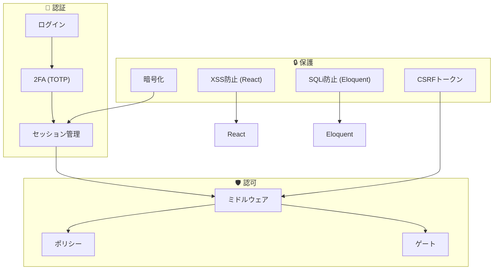

### セキュリティチェックリスト

| 項目 | 実装 | 場所 |
|-----|------|------|
| パスワードハッシュ | bcrypt | Laravel標準 |
| CSRFトークン | `@csrf` / Inertia自動 | フォーム |
| XSS防止 | Reactエスケープ | JSX |
| SQLインジェクション | Eloquent / Prepared Statements | モデル |
| 認証 | Laravel Fortify | ミドルウェア |
| 2FA | TOTP | `TwoFactorAuthenticatable` |
| 認可 | ポリシー + ミドルウェア | コントローラー |
| 入力検証 | FormRequest | リクエスト |

---

## パフォーマンス設計

### N+1問題の回避

```php
// ❌ BAD: N+1クエリ発生
$books = Book::all();
foreach ($books as $book) {
    echo $book->authors; // 毎回クエリ発行
}

// ✅ GOOD: Eager Loading
$books = Book::with(['authors', 'tags'])->get();
```

### キャッシュ戦略

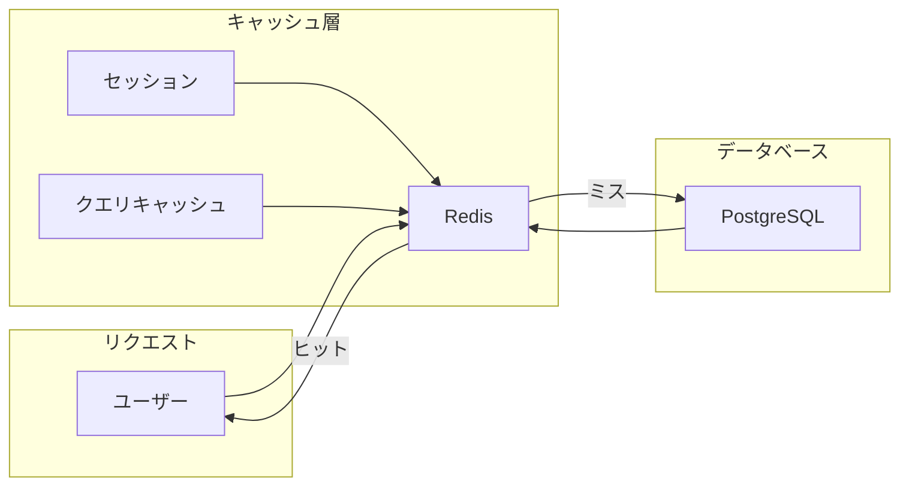

### 推奨キャッシュ対象

| データ | キャッシュ有効期間 | 理由 |
|--------|------------------|------|
| 書籍一覧 | 1時間 | 頻繁な変更なし |
| タグ一覧 | 1日 | ほぼ静的 |
| ユーザーセッション | 2時間 | セキュリティバランス |
| 検索結果 | 10分 | 鮮度とパフォーマンスのバランス |

---

## 付録: ディレクトリ構造クイックリファレンス

```
BookVault-Laravel/
├── app/
│   ├── Http/
│   │   ├── Controllers/
│   │   │   ├── Admin/           # 管理者専用
│   │   │   ├── Api/             # REST API
│   │   │   ├── Settings/        # ユーザー設定
│   │   │   └── *.php            # 一般コントローラー
│   │   ├── Middleware/          # カスタムミドルウェア
│   │   └── Requests/            # バリデーション
│   ├── Models/                  # Eloquentモデル
│   ├── Policies/                # 認可ポリシー
│   └── Services/                # ビジネスロジック
│
├── resources/js/
│   ├── pages/
│   │   ├── admin/               # 管理画面
│   │   ├── auth/                # 認証画面
│   │   ├── books/               # 書籍関連
│   │   └── settings/            # 設定画面
│   ├── components/
│   │   ├── ui/                  # Radix UI ラッパー
│   │   └── *.tsx                # カスタムコンポーネント
│   ├── layouts/                 # ページレイアウト
│   ├── hooks/                   # カスタムフック
│   └── types/                   # TypeScript型定義
│
├── routes/
│   ├── web.php                  # Webルート (Inertia)
│   ├── api.php                  # APIルート (JSON)
│   └── settings.php             # 設定ルート
│
├── tests/
│   ├── Feature/                 # 統合テスト
│   └── Unit/                    # 単体テスト
│
└── docs/                        # ドキュメント
    └── Architecture.md          # このファイル
```

---

## 更新履歴

| 日付 | 更新内容 | 担当 |
|------|---------|------|
| 2026-01-31 | 初版作成 | - |

---

> 💡 **このドキュメントの保守について**
> 
> 新機能追加や設計変更時は、このドキュメントも同時に更新してください。
> コードとドキュメントの乖離は、技術的負債の原因となります。
